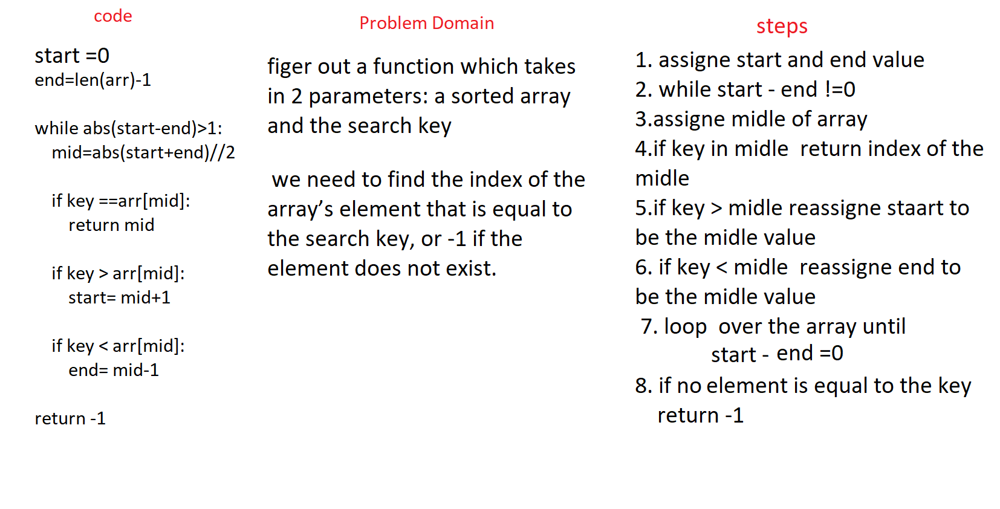

# Challenge Summary
Binary Search 

## Challenge Description
create a method that take an array and key as a parameter and return

## Approach & Efficiency
this code will loop over an array and serch for the index of the array’s element that is equal to the search key, or -1 if the element does not exist.

## Solution

