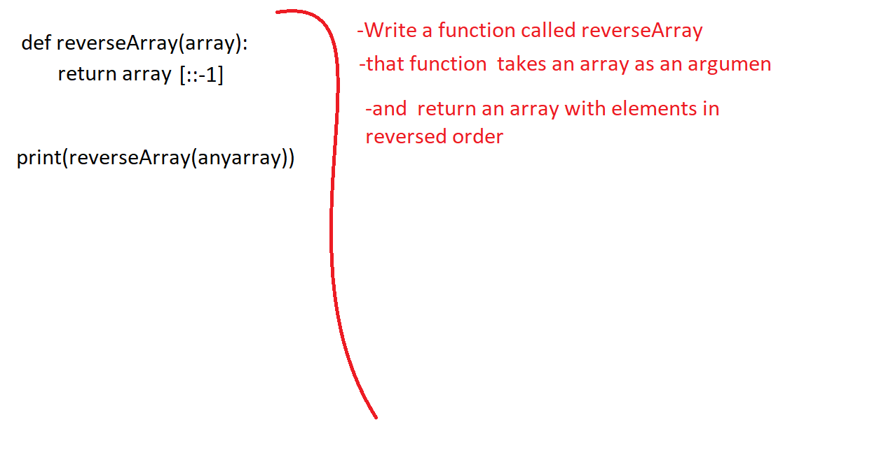

# Reverse an Array
* revers any array 

## Challenge
* create a method that take an array as a parameter and return the same reversed array

## Approach & Efficiency
* this code will make the array starts from the last elemint so the array will be reversed

## Solution

