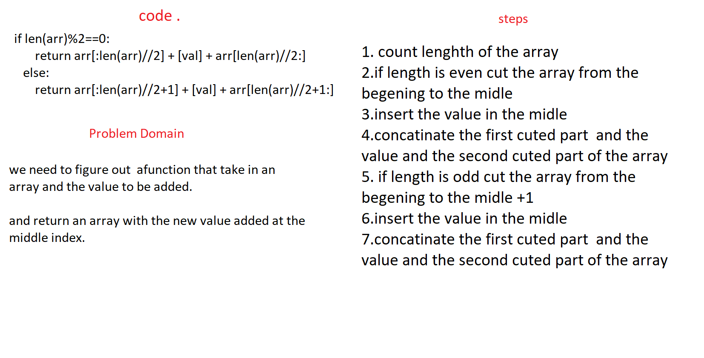

# Reverse an Array
* insert value in the midle of array

## Challenge
* create a method that take an array and value as a parameter and return an array with the new value added at the middle index.

## Approach & Efficiency
* this code will make the value inserted in the midle of the array 

## Solution

