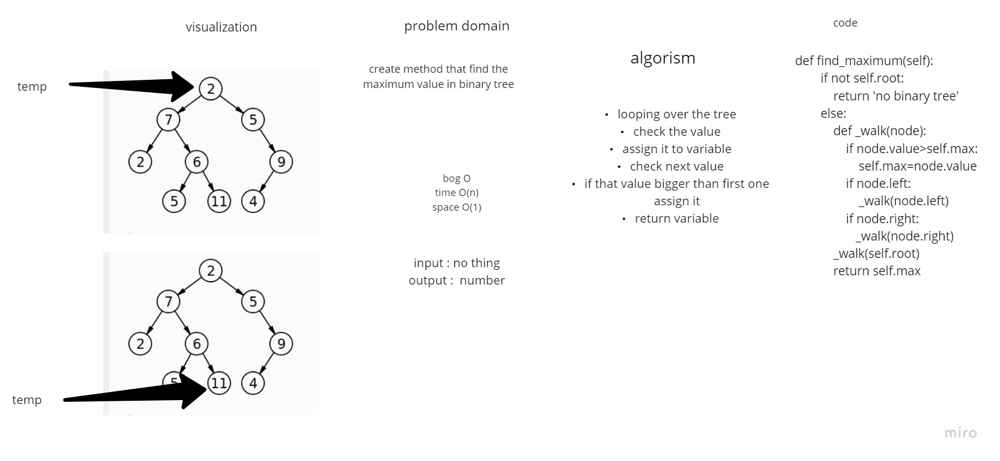

# Challenge Summary
binary tree

binary search tree

## Challenge Description
A binary search tree is a binary tree with the following properties: The data stored at each node has a distinguished key which is unique in the tree and belongs to a total order. The key of any node is greater than all keys occurring in its left subtree and less than all keys occurring in its right subtree.

## Approach & Efficiency
**sort** binary tree as :
* Pre-order: root >> left >> right
* In-order: left >> root >> right
* Post-order: left >> right >> root

**binary search tree** methods :
* add--> accepts a value, and adds a new node with that value in the correct location in the binary search tree.
* contains--> accepts a value, and returns a boolean indicating whether or not the value is in the tree at least once.

start time 3.00  
end time 8.00

start time 6.00  
end time 8.00
