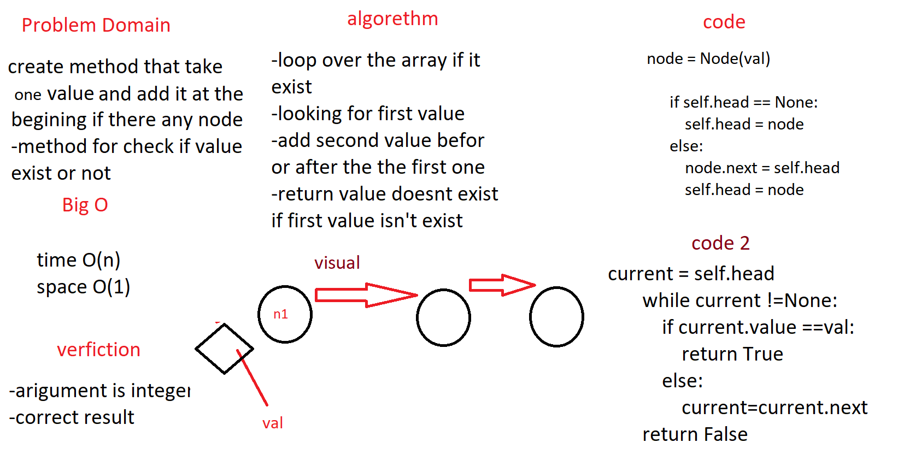
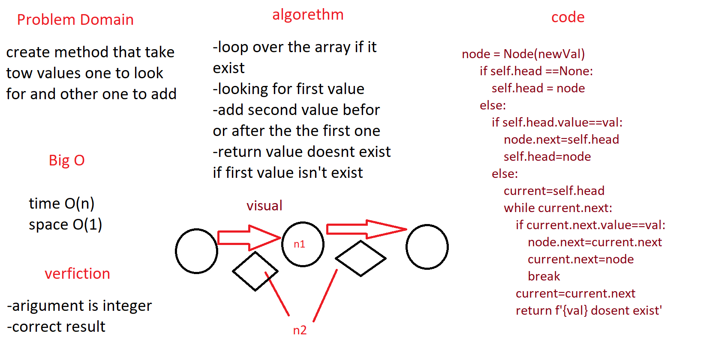

# Challenge Summary
linked list

## Challenge Description
create a method that take an value to look and value to add as a parameter and return an array of values with right places 

## Approach & Efficiency
this code will loop over an array and serch for the first value and add the second value (befor/after)it and  returen element does not exist if the value isn't exist

## Solution

