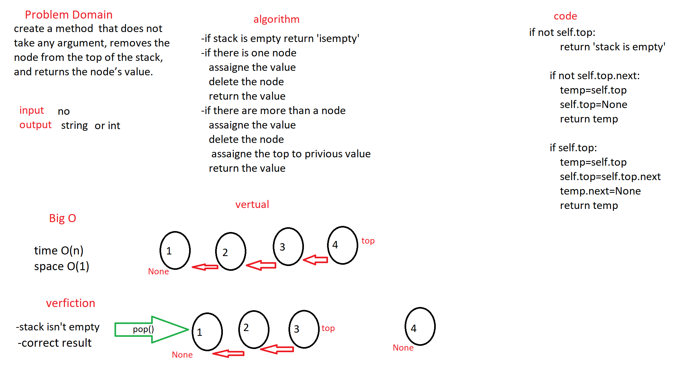

# Challenge Summary
stacks & queues

## Challenge Description
* create `enqueue`, `dequeue`, `peek`, `isempty` methods for `queue`
* create `push`, `pop`, `peek`, `isempty` methods for `stack`

## Approach & Efficiency
this code will loop over the stack/queue and add  the value in (rear/top)
and delet value from (front/top) 
and  returen `empty` for empty list  

## Solution
